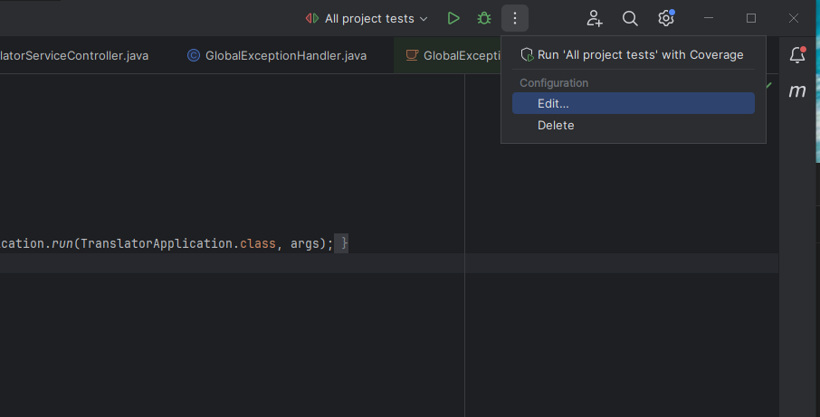
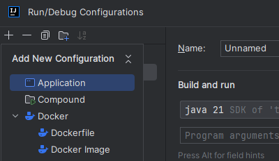
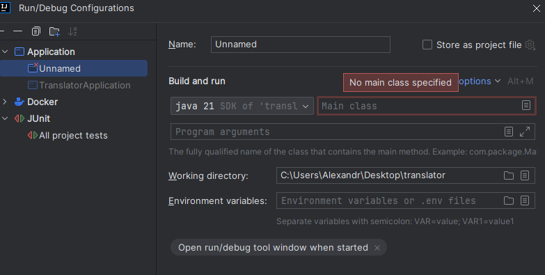
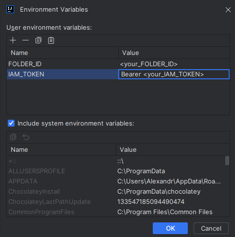
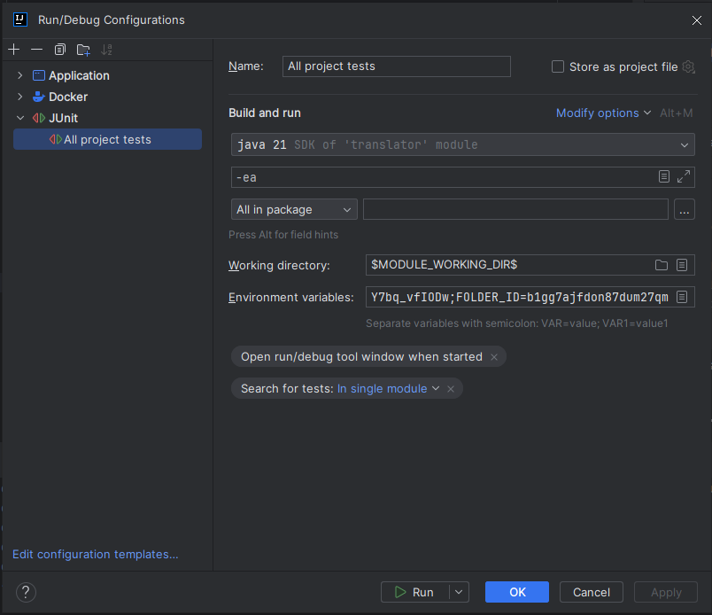

# Translator application

Этот проект представляет собой простое приложение для перевода текста, разработанное на языке Java с использованием
фреймворка Spring Boot.

## Содержание

- [Требования](#требования)
- [Установка](#установка)
- [Запуск приложения](#запуск-приложения)
- [Использование](#использование)
- [Тестирование](#тестирование)
- [Контакты](#контакты)

## Требования

Для работы приложения вам потребуются:

- Java 17 или выше
- Docker Desktop (https://www.docker.com/products/docker-desktop)
- Maven или Среда разработки Intellij IDEA

## Установка

1. Склонируйте репозиторий на свой компьютер и перейдите в папку с проектом:

   ```bash
   git clone https://github.com/weuizx/TranslatorApplication.git
   cd TranslatorApplication
   ```
2. Убедитесь что на компьютере запущен Docker compose и запустите контейнер с базой данных и системой версионирования
   ```bash
   docker-compose up
   ```
3. Получите IAM токен и идентификатор каталога, к которому у вас есть доступ из Yandex cloud или обратитесь в телеграм
   @weuizx за актуальными данными для запуска


4. Соберите проект с помощью Maven:

   На MacOs/Linux (в новом терминале):
    ```bash
   export FOLDER_ID="<your_FOLDER_ID>"; export IAM_TOKEN="Bearer <your_IAM_TOKEN>"; mvn clean install
   ```
   На Windows:

   ```bash
   $env:FOLDER_ID="<your_FOLDER_ID>";$env:IAM_TOKEN="Bearer <your_IAM_TOKEN>"; mvn clean install
   ```
   ИЛИ

   Настройте конфигурации запуска в Intellij IDEA:
    1. Откройте настройки конфигураций  
       
    2. Нажмите "Добавить конфигурацию" -> приложение  
       
    3. Укажите путь до класса TranslatorApplication  
       
    4. Добавьте в переменные среды IAM_TOKEN и FOLDER_ID из предыдущего пункта(значение IAM_TOKEN формате Bearer <
       your_IAM_TOKEN>)  
       
    5. Таким же образом создайте конфигурацию JUnit -> All in package  
       

## Запуск приложения

Для запуска приложения используйте следующую команду:

```bash
mvn spring-boot:run
```

ИЛИ  
используйте созданные конфигурации запуска

По умолчанию приложение будет доступно по адресу: [http://localhost:8080](http://localhost:8080)

#### Если у вас возникают проблемы с запуском приложения, попробуйте поменять порт postgresql в docker-compose.yml -> services.postgresql.ports и в application.yml ->spring.datasource.url

## Использование

После запуска приложения, вы можете воспользоваться единственным эндпоинтом:

- POST /translate - получить перевод  

Для проверки функциональности вы можете воспользоваться приложением Postman или
интерфейсом [SwaggerUI](http://localhost:8080/swagger-ui)(ссылка доступна после старта приложения)  

Обязательные поля в теле запроса: sourceLanguageCode, targetLanguageCode, text  
Пример запроса:  
{   
    "sourceLanguageCode": "en",  
    "targetLanguageCode": "ru",  
    "text": "snail"  
}  
Список доступных кодировок языка можно найти здесь https://yandex.cloud/ru/docs/translate/concepts/supported-languages  
#### Для просмотра записей в базе данных вы можете использовать подключение через DBeaver или Intellij IDEA Ultimate  

## Тестирование

В проекте предусмотрены тесты, которые можно запустить с помощью следующей команды:

```bash
mvn test
```

ИЛИ  
с помощью созданной конфигурации запуска Intellij IDEA  

## Контакты

Для вопросов и предложений обращайтесь:

- Телеграм: @weuizx
- Email: weuizx@gmail.com
- GitHub: [weuizx](https://github.com/weuizx)
